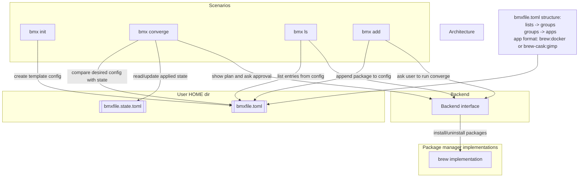
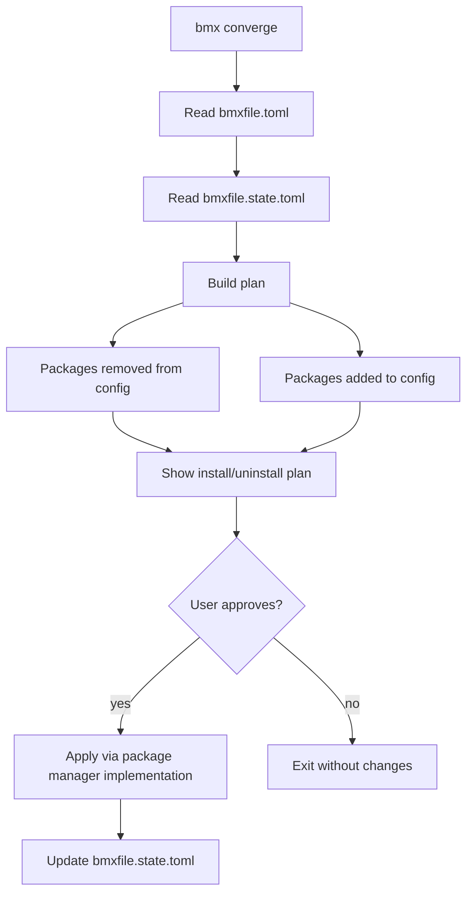
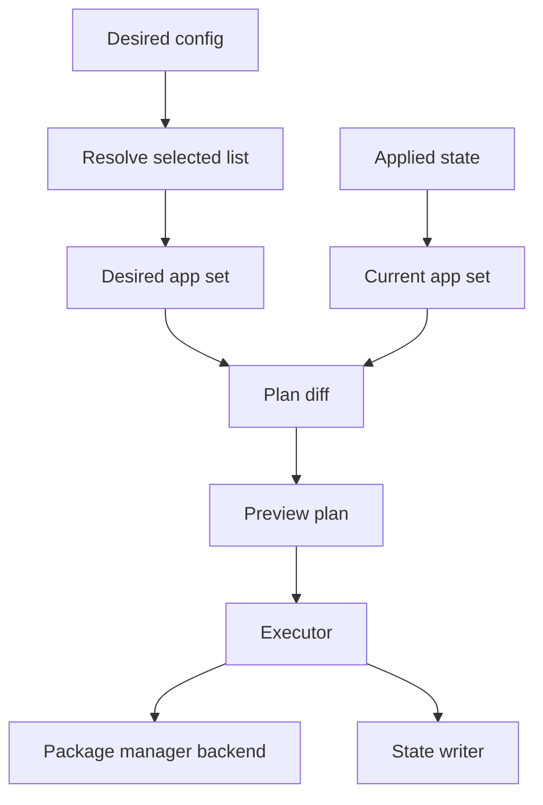
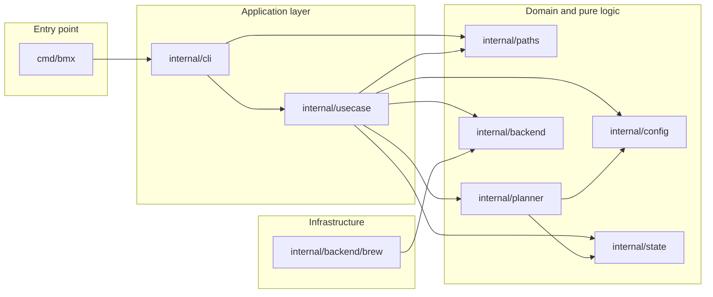
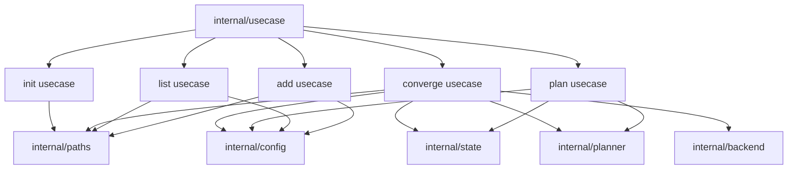

# BMX Architecture Diagrams

## High-Level Architecture

```mermaid
flowchart TD
    title["Architecture"]

    subgraph scenarios["Scenarios"]
        init["bmx init"]
        converge["bmx converge"]
        ls["bmx ls"]
        add["bmx add"]
    end

    subgraph backendLayer["Backend"]
        backend["Backend interface"]
    end

    subgraph implementations["Package manager implementations"]
        brew["brew implementation"]
    end

    subgraph home["User HOME dir"]
        bmxfile[["bmxfile.toml"]]
        state[["bmxfile.state.toml"]]
    end

    schema["bmxfile.toml structure:
    lists -> groups
    groups -> apps
    app format: brew:docker or brew-cask:gimp"]

    init -->|"create template config"| bmxfile
    converge -->|"compare desired config with state"| bmxfile
    converge -->|"read/update applied state"| state
    converge -->|"show plan and ask approval"| backend

    ls -->|"list entries from config"| bmxfile
    ls --> backend

    add -->|"append package to config"| bmxfile
    add -->|"ask user to run converge"| backend

    backend -->|"install/uninstall packages"| brew
    schema --> bmxfile
```

## Converge Flow

```mermaid
flowchart TD
    start["bmx converge"] --> readConfig["Read bmxfile.toml"]
    readConfig --> readState["Read bmxfile.state.toml"]
    readState --> diff["Build plan"]

    diff --> removed["Packages removed from config"]
    diff --> added["Packages added to config"]

    removed --> plan["Show install/uninstall plan"]
    added --> plan

    plan --> approval{"User approves?"}
    approval -->|"yes"| apply["Apply via package manager implementation"]
    approval -->|"no"| stop["Exit without changes"]

    apply --> updateState["Update bmxfile.state.toml"]
```

## Suggested Internal Data Flow

```mermaid
flowchart TD
    config["Desired config"] --> resolver["Resolve selected list"]
    resolver --> desired["Desired app set"]
    state["Applied state"] --> current["Current app set"]
    desired --> planner["Plan diff"]
    current --> planner
    planner --> preview["Preview plan"]
    preview --> executor["Executor"]
    executor --> backend["Package manager backend"]
    executor --> stateWriter["State writer"]
```

## Suggested Package Dependencies

```mermaid
flowchart LR
    subgraph entry["Entry point"]
        main["cmd/bmx"]
    end

    subgraph app["Application layer"]
        cli["internal/cli"]
        usecase["internal/usecase"]
    end

    subgraph domain["Domain and pure logic"]
        paths["internal/paths"]
        config["internal/config"]
        state["internal/state"]
        planner["internal/planner"]
        backend["internal/backend"]
    end

    subgraph impl["Infrastructure"]
        brew["internal/backend/brew"]
    end

    main --> cli

    cli --> paths
    cli --> usecase

    usecase --> config
    usecase --> state
    usecase --> planner
    usecase --> backend
    usecase --> paths

    planner --> config
    planner --> state

    brew --> backend
```

### Usecase ownership

```mermaid
flowchart TD
    usecase["internal/usecase"]

    init["init usecase"]
    converge["converge usecase"]
    list["list usecase"]
    plan["plan usecase"]
    add["add usecase"]

    usecase --> init
    usecase --> converge
    usecase --> list
    usecase --> plan
    usecase --> add

    init --> paths["internal/paths"]

    converge --> config["internal/config"]
    converge --> state["internal/state"]
    converge --> planner["internal/planner"]
    converge --> backend["internal/backend"]
    converge --> paths

    plan --> config
    plan --> state
    plan --> planner

    list --> config
    list --> paths

    add --> config
    add --> paths
```
